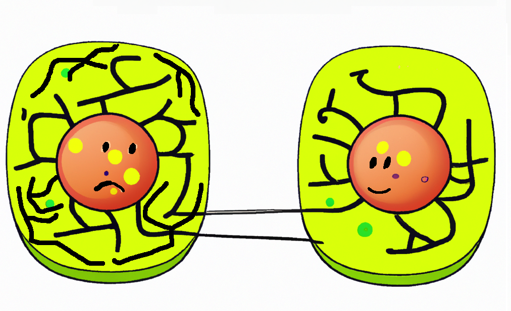
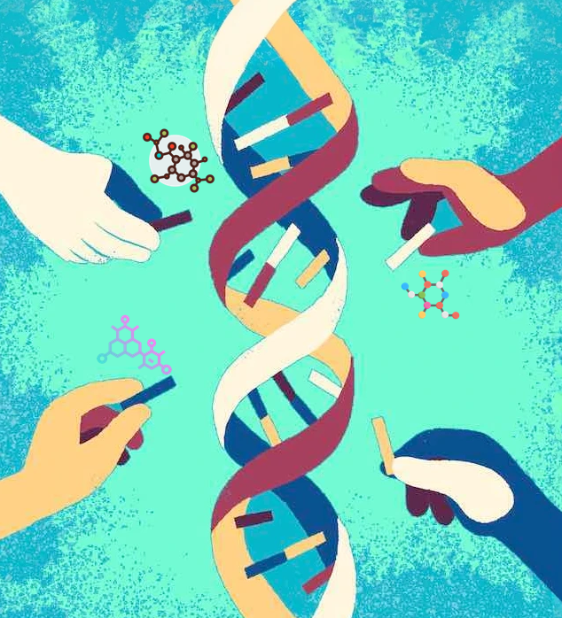
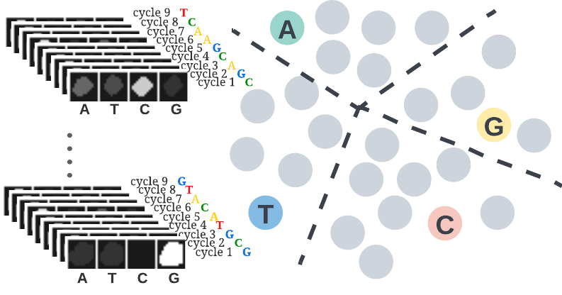
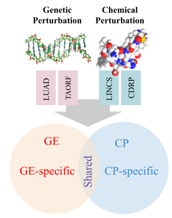
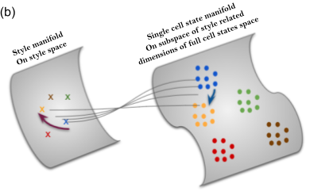
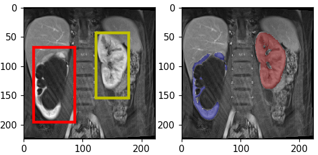
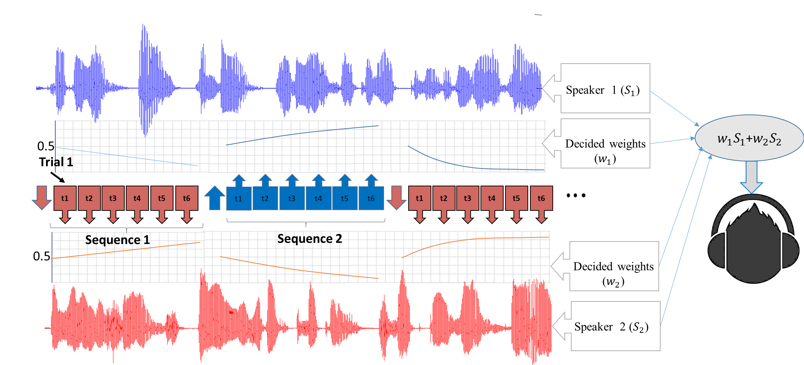

### Recent Projects:

---
### Identifying and targeting the cellular morphological impact of psychiatric diseases: 

  

    
  

    We developed a high-throughput assay system for identifying candidate small molecules for psychiatric disease. Mitochondrial abnormalities in patients with psychiatric illness have been reported in the literature through genetic, brain imaging, and peripheral cell studies. Using high-content microscopy imaging and machine learning, we identified skin fibroblasts cellular fingerprints of disease based on structural changes in mitochondria among patients with four different psychiatric conditions: schizophrenia, schizoaffective disorder, bipolar disorder, and major depression. Taking the differential mitochondrial structure fingerprints among the groups of patients, we searched for possible therapeutics by mining existing image datasets of cell samples treated with tens of thousands of small molecules. We are currently collaborating with NIH NCATS to run experiments to validate this assay system and then screen to identify novel candidate compounds targeting these diseases.

*(In preparation for submission)*

---
### Protein localization of rare disease variants: 

#### Systematic characterization

  

    
  

  <!-- 
 -->
In collaboration with Taipale lab  (University of Toronto), we systematically characterize the protein localization of disease variants by high-content microscopy. The Taipale lab had generated a catalog of types of mislocalization, scoring images by eye. However, we improved the characterization of the alleles with an advanced, automated morphological profiling approach. We tapped into the potential of using the entire spectrum of morphological measurements for detecting mutant phenotypes, instead of focusing on localization alone.
<!-- 
 -->

  - *Link to the github repo*
  - *Link to the paper*

#### The path for drug discovery

<!-- 
 -->
  The path for a virtual drug screen in this project is not straightforward. In this project, we don't have access to a compound dataset of protein localizations to use as a reference for a virtual drug screen, and carrying out hundreds of individual drug screens is impractical due to the cost. We are facilitating a huge screen of compounds, however, by taking advantage of the pooled optical profiling strategy developed by Blainey lab at the Broad Institute. By pooled optical screens, we can test thousands of drugs against hundreds of barcoded disease-associated phenotypes in a single reasonably sized experiment, which is currently in the pilot stage.
<!-- 
 -->

*(In progress)*
       

---

### Decoding barcodes from In-Situ-Sequencing images

  

    
  

  <!-- 
 -->
We developed and introduced a framework which exploits a novel self-training learning strategy to address the barcode calling problem. The proposed self-training strategy can start from a small set of noisy labels and correct for noise overfitting by batch supervision. This work involved creative incorporation of a side prior knowledge about barcodes which is not in the regular form of annotations. Despite the focus of this work on the barcode calling problem, the introduced general learning strategy can be extended to use in other domains of data with contextual information. And crucially, this work will contribute to the efficiency and quality of the pooled drug screen experiments and data analysis.
  <!-- 
 -->

  - *Link to the github repo*
  - *Link to the paper*

---
### Multi-modal data regimen coupled with Cell Painting
#### $\circle$ Commentary on the opportunities and benchmarking the problem at the population-level 

  

    
  

  <!-- 
 -->
  We delve into the potential opportunities that a multi-modal gene expression and cell painting dataset provide. We define biological problems that use the shared and complementary information in these two data modalities, provide baseline analysis and evaluation metrics for multi-omic applications by using four genetic and compound datasets to test hypotheses of complementary or predictive nature of these two data types at the bulk level. 
  <!-- 
 -->

  - *Link to the github repo*
  - *Link to the paper*

#### Multi-domain representation learning 

  

  

    
  

   Learning representations directly from single cell images has received attention in recent years. Unbiased approaches suffer from noise and redundancy which prevent us from exploiting the full power of such data sources in morphological profiling and their emerging application in the drug discovery pipeline. Ideally, we want to learn representations that are unbiased from weak and erroneous human based annotations and at the same time disentangled from technical variations and experimental noise. We propose a novel multi-purpose framework (CellStyle) for learning representations directly from single cell images using various types of supervisory signals without compromising any unknown yet potentially useful properties of the data. The framework is based on an autoencoder that directly learns two orthogonal subspaces of data, called content and style. We define style and content in the context of various profiling tasks each using a unique source of supervisory signal. 

*(In progress)* 

---

### Past Projects:
---
### Automatic Renal Segmenter

  

    
  

  Kidney function evaluation using dynamic contrast-enhanced MRI (DCE-MRI) images could help in diagnosis and treatment of kidney diseases of children. Automatic segmentation of renal parenchyma is an important step in this process. In this paper, we propose a time and memory efficient fully automated segmentation method which achieves high segmentation accuracy with running time in the order of seconds in both normal kidneys and kidneys with hydronephrosis. The proposed method is based on a cascaded application of two 3D convolutional neural networks that employs spatial and temporal information at the same time in order to learn the tasks of localization and segmentation of kidneys, respectively. 

  - *Link to the paper*

---

### EEG-assisted Modulation of Sound Sources in the Auditory Scene

  

    
  

  <!-- 
 -->
    Noninvasive auditory attention detection Brain Computer Interfaces (BCIs) could be useful for improved hearing aids in the future. EEG (electroencephalography) has been demonstrated to exhibit useful evidence regarding auditory attention in the presence of multiple competing speech waveforms. This work is a novel attempt to investigate the feasibility of online modulation of sound sources by probabilistic detection of auditory attention, using a noninvasive EEG-based brain computer interface. Proposed online system modulates the upcoming sound sources through gain adaptation which employs probabilistic decisions (soft decisions) from a classifier trained on offline calibration data. The goal of the online system is using the probabilistic information of the user's attention to enhance the concentration of the user on the target source in multi-speaker scenarios. Through 3 phases of study and experiments we have explored and improved the system by optimizing the model, features and the experimental designs. 
  <!-- 
 -->

  - *Links (1,2) to the papers*

---